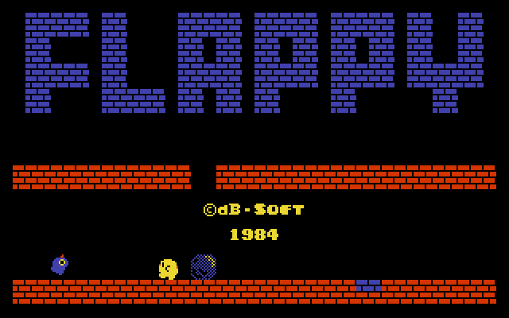
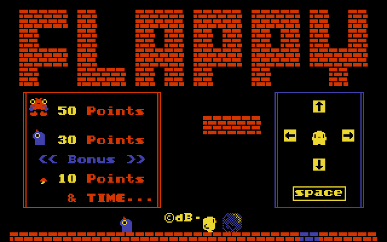
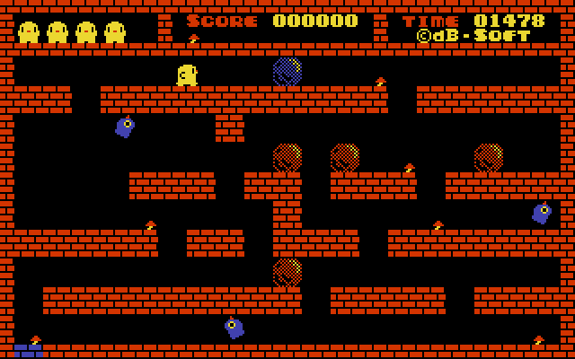
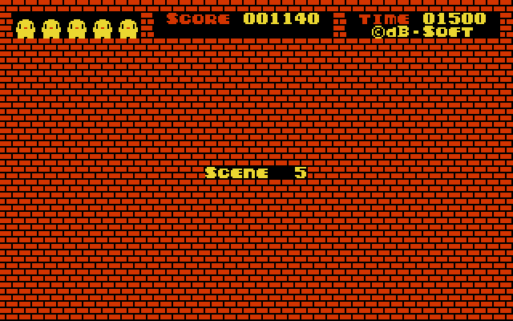
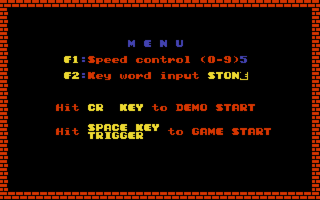

# Flappy pro Tesla SAPI-1

Port logické hry **Flappy** (dB-SOFT 1984) z počítače **Sharp MZ-800** na **Tesla SAPI-1** v sestavě „V“
Libora Lasoty s barevnou grafikou **CGA-1V** a zvukovou kartou **MPH-1V**. Hra běží pod CP/M jako
`FLAPPY.COM`.

Flappy je hlavolam: v každé úrovni je potřeba dostat modrý kámen na modré pole, v cestě jsou zdi, další
kameny, potvory a běží čas. Hra má 200 úrovní a hesla, kterými se dá začít od pozdějších úrovní.

| | |
|---|---|
|  |  |
|  |  |

## Stav

- **Hra je celá:** titulek s demem, návod, 200 úrovní, menu (rychlost 0–9, heslo), konec hry, závěrečná
  sekvence po 200. úrovni, hudba, joystick i klávesnice, návrat do CP/M.
- **Vypadá a hraje se stejně jako na MZ-800:** obsah obrazovky portu je v každém herním kroku bajt po bajtu
  stejný jako u originálu v emulátoru MZ-800 (titulek, hra, smrt, konec hry, menu, heslo, dokončení úrovně,
  závěr).
- Hra běží stejně rychle jako na MZ-800 při CPU 2 i 4 MHz.
- **Ověřeno na skutečném SAPI-1** (sestava V) i v emulátoru [SAPIemu](https://github.com/mlukasek/SAPIemu)
  0.3.0-alpha.
- Aktuální verze: **1.0.0** (hotové `FLAPPY.COM` je v [Releases](https://github.com/mlukasek/SAPI-Flappy/releases)).

## Co je potřeba

- SAPI-1 se sestavou V: **JPR-1V** (Z80, 2 nebo 4 MHz), **RAM-1V** (64 KB, registr MAP na 63h), **CGA-1V**
  na C000h při MAP1 = MAP2 = H a **MPH-1V** na 50h (zvuk YM3812, joystick na K4), CP/M s TPA aspoň do BFFFh.
- Klávesnice Consul 262.3 (s úpravou 7474 i bez ní) nebo EKL-1, případně joystick Atari na MPH-1V.
- Obraz jde na monitor VGA karty CGA-1V, CP/M zůstává na textové obrazovce.

## Spuštění

1. Stáhnout `FLAPPY.COM` (nebo `FLAPPY.HEX`) z [Releases](https://github.com/mlukasek/SAPI-Flappy/releases),
   nebo přeložit (Windows): `build.cmd` → `build\flappy.com` a `build\flappy.hex`. Překlad potřebuje Python 3
   a assembler pasmo 0.5.3 (cesta v `build.cmd` nebo proměnná `PASMO`).
2. Dostat program do SAPI, např. v SAPIemu Soubor → Nahrát program do paměti (`build\flappy.hex`) a v CP/M
   `SAVE 188 FLAPPY.COM`.
3. Spustit `FLAPPY`. Konec klávesou ESC, hra se vrátí do CP/M.

## Ovládání

| Akce | Joystick (K4) | Consul 262.3 | EKL-1 |
|---|---|---|---|
| pohyb | páka | šipky | šipky |
| start hry z titulku, akce ve hře | palba | mezerník | mezerník |
| vzdát úroveň (na MZ BREAK) | | BREAK nebo Backspace | Backspace |
| menu (po konci hry) | | CR | CR |
| F1 rychlost, F2 zadání hesla (v menu); F1–F5 rychlost ve hře | | ROL = F1, COPY = F2, klávesy 61–63 = F3–F5, nebo Ctrl+A, B, C, F, G | Ctrl+A, B, C, F, G |
| konec, návrat do CP/M | | ESC | ESC |

- Hra se ovládá tím zařízením, kterým se spustila: mezerníkem klávesnice, palbou joystick.
- **Jedno stisknutí šipky posune postavu o půl políčka.** S joystickem nebo klávesnicí s autorepeatem (PC
  v emulátoru) jde postava plynule; Consul 262.3 autorepeat nemá, chodí se ťukáním nebo joystickem.
- **Hesla rozlišují malá a velká písmena** (např. `MegmI`, `STONE`). Píšou se normálně, malá písmena a `!`
  port převede na SHIFT jako na MZ-800.

## Co je jinak než na MZ-800

- **Ovládání klávesnicí:** klávesnice SAPI nehlásí, kdy se klávesa pustí. Port ji drží stisknutou, dokud ji
  hra nepřečte; krátký stisk tak hra nepřehlédne, plynulá chůze ale potřebuje autorepeat nebo joystick.
- **Funkční klávesy F1–F5** nejsou na klávesnicích SAPI, nahrazují je Ctrl+písmeno (u Consulu i ROL, COPY,
  klávesy 61–63). BREAK je Backspace.
- **Zvuk:** místo čipu SN76489 hraje YM3812 (OPL2) karty MPH-1V. Noty, rytmus i hlasitost jsou stejné, barva
  tónu je jiná (FM místo obdélníku), šum je jen přibližný.
- **Hudba v titulku hraje asi o 7 % rychleji.** Port tiká pevně podle tempa hry, originál v titulku mírně
  zpomaloval.
- **Barvy** jsou převzaté z emulátoru mz800emu; skutečné MZ-800 může mít odstíny trochu jiné.
- Druhý joystick (MZ-800 port F1h) port nemá.

## Dokumentace

| Soubor | Co |
|---|---|
| [docs/port.md](docs/port.md) | jak je port udělaný: paměť, porty, grafika, časování, zvuk, klávesnice, měření |
| [docs/original.md](docs/original.md) | rozbor originálu pro MZ-800 |
| [docs/vyvoj.md](docs/vyvoj.md) | vývoj: zdroje, nástroje, emulátory, ověřování, práce na jiném počítači, pasti |
| [docs/rozhodnuti.md](docs/rozhodnuti.md) | rozhodnutí s důvody a poznatky z vývoje |
| [docs/hw-otazky.md](docs/hw-otazky.md) | ověření na skutečném hardwaru |
| [docs/release-notes/v1.0.0.md](docs/release-notes/v1.0.0.md) | poznámky k vydání 1.0.0 |

## Autoři a poděkování

- Hra Flappy: © dB-SOFT 1984, verze pro Sharp MZ-800.
- Port na SAPI-1: Martin Lukášek, 2026, s pomocí Claude (Anthropic).
- Karty sestavy V (JPR-1V, RAM-1V, CGA-1V, MPH-1V): Libor Lasota.
- Emulátor MZ-800 s MCP [mz800emu](https://github.com/michalhucik/mz800emu): Michal Hučík. Na něm se originál
  rozebíral a port s ním byl porovnáván.

Originální program pro MZ-800 v repozitáři není, je chráněný autorským právem.
